# Chapter 1 — Welcome to the AI Revolution!

## Slide 01 — AI4Dev

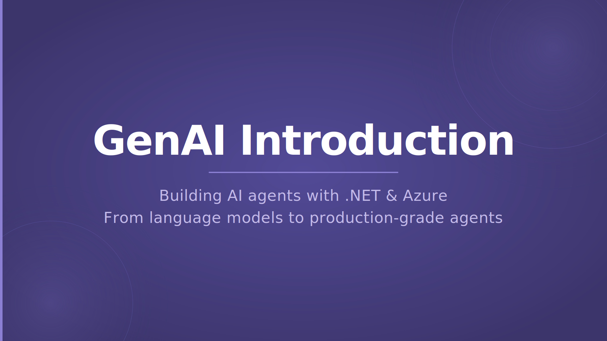

---

## Slide 02 — Chapter 1 — Welcome to the AI Revolution!

---

## Slide 03 — The Evolution of AI

AI has evolved through distinct waves: the rule-based expert systems of the 1980s, the statistical machine learning era of the 1990s and 2000s, the deep learning breakthrough, and today's large language models. Each wave built on the previous one — LLMs did not appear overnight.

Understanding this lineage helps set realistic expectations. Current AI is powerful because of decades of incremental research, but it also inherits limitations from each step along the way.

---

## Slide 04 — Types of Machine Learning

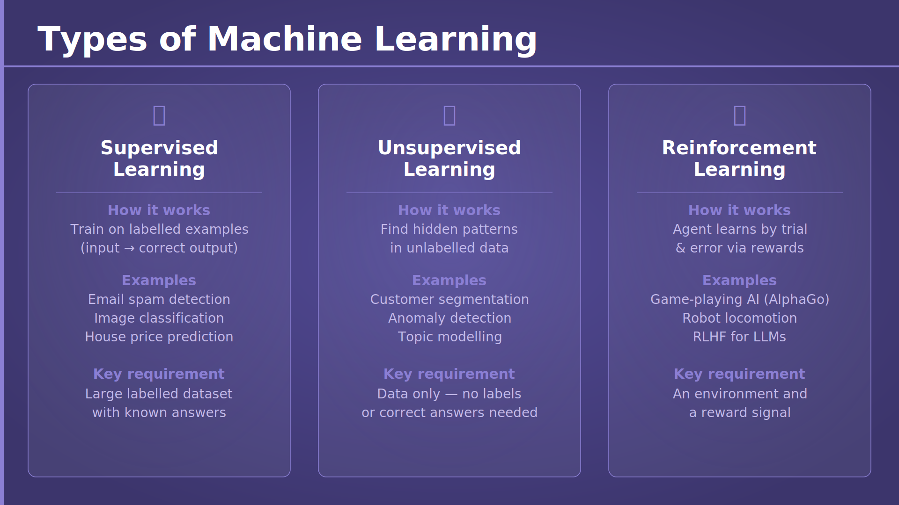

Machine learning comes in three core flavours. **Supervised learning** trains on labelled input–output pairs to predict labels for new inputs — the foundation of most practical ML today. **Unsupervised learning** finds structure in unlabelled data, useful for clustering and anomaly detection. **Reinforcement learning** trains an agent by having it take actions, receive reward signals, and update its behaviour accordingly.

LLMs use supervised and self-supervised pre-training followed by reinforcement learning from human feedback (RLHF) to align their behaviour with what users actually want.

---

## Slide 05 — Features, Labels & Learning Tasks

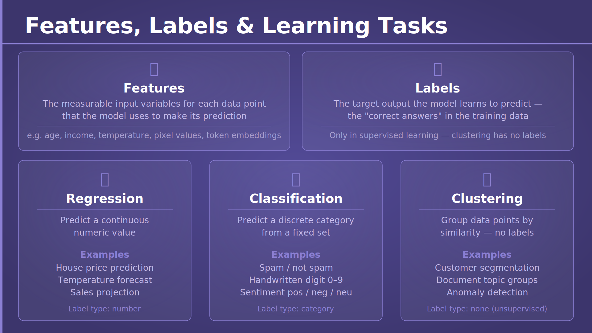

**Features** are the measurable input variables for each data point — the properties the model uses to make its prediction (age, income, temperature, pixel values, token embeddings). **Labels** are the target outputs the model learns to predict: the correct answers in the training data. Labels only exist in supervised learning; clustering has none.

The type of label determines the task type. **Regression** predicts a continuous numeric value (house price, temperature, sales projection). **Classification** predicts a discrete category from a fixed set (spam/not spam, digit 0–9, sentiment positive/negative/neutral). **Clustering** is unsupervised — it groups data points by similarity without any predefined labels, letting structure emerge from the data itself.

---

## Slide 06 — The Reinforcement Learning Loop

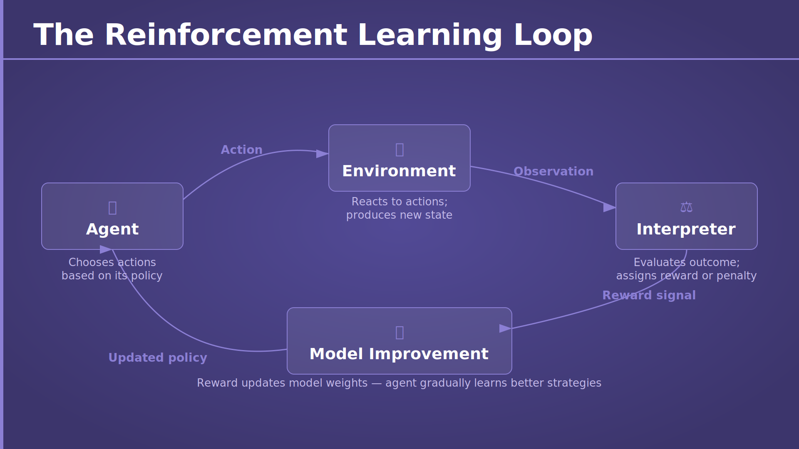

In the reinforcement learning cycle, an agent observes the current state of its environment, selects an action, receives a reward or penalty, and updates its policy. Over many iterations it learns which actions lead to the best cumulative reward.

For LLMs this takes the form of RLHF: human raters score model outputs, those scores train a reward model, and the reward model is used to fine-tune the LLM via proximal policy optimisation. This is the step that transforms a raw next-token predictor into a helpful, instruction-following assistant.

---

## Slide 07 — Generative AI — The GAN Idea

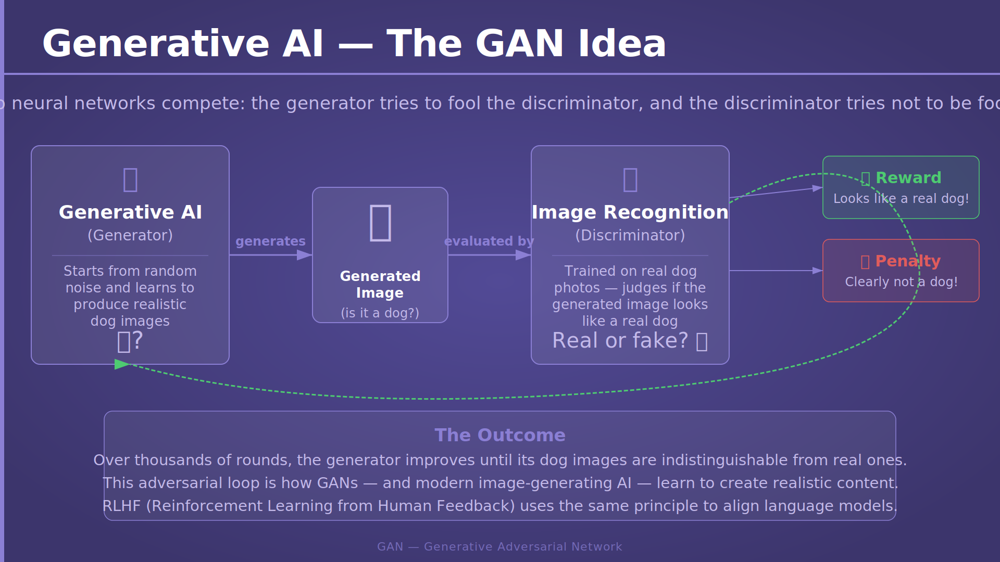

A Generative Adversarial Network pits two networks against each other: a **generator** produces candidate outputs (images, text, audio), while a **discriminator** tries to tell generated samples from real ones. The two compete until the generator produces outputs the discriminator can no longer distinguish from reality.

Diffusion models have largely superseded GANs for image generation, but the adversarial "generate and critique" idea established the conceptual DNA of modern generative AI — and explains why generative models can produce surprisingly high-quality outputs.

---

## Slide 08 — AI Is Not One Thing — A Quick Taxonomy

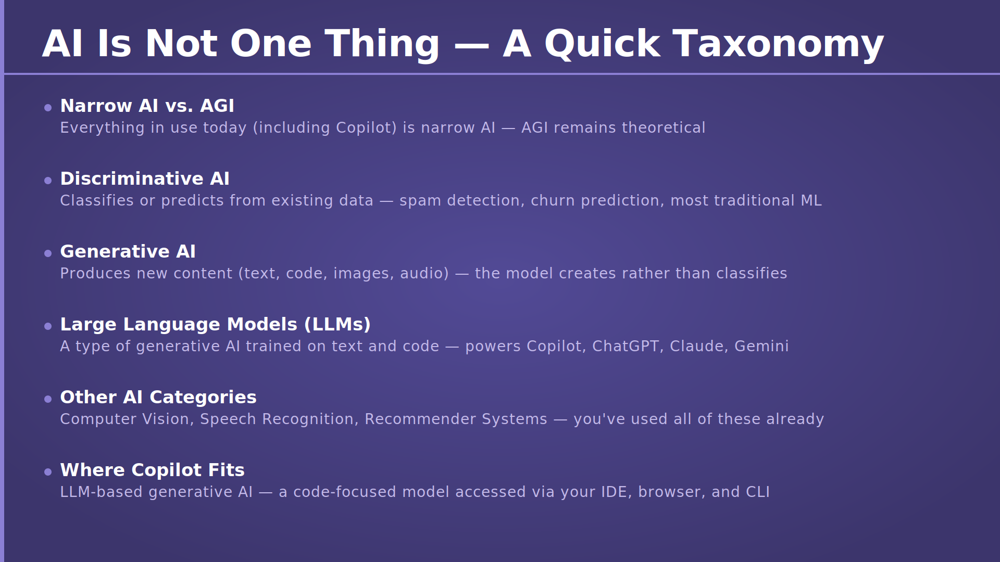

"AI" is not a single technology. The field covers large language models for text generation and reasoning, embedding models for semantic search, image generation models, speech-to-text transcription, text-to-speech synthesis, vision models for image understanding, and code generation models.

Each maps to a specific Azure AI service or model deployment. Knowing the taxonomy prevents reaching for a chat model when an embedding model is the right tool, or vice versa.

---

## Slide 09 — How LLMs Actually Work

LLMs are **next-token predictors** trained at massive scale. Text is broken into **tokens** (subword units), converted into high-dimensional vectors, and processed through attention layers that allow every token to attend to every other token in the context. The model outputs a probability distribution over the vocabulary and samples the next token.

LLMs do not retrieve facts from a database — they interpolate patterns learned during training. This explains both their fluency and their tendency to confabulate plausible-sounding but incorrect information.

---

## Slide 10 — LLM Temperature — Choosing the Right Setting

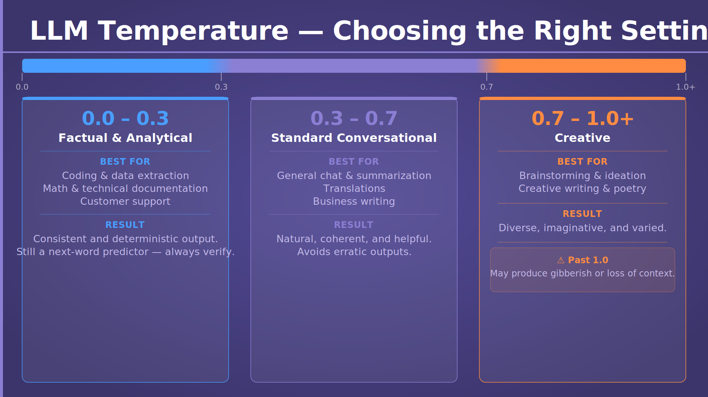

The **temperature** parameter controls how the model samples from its probability distribution over possible next tokens. At temperature 0, it always picks the highest-probability token, producing deterministic, conservative output. As temperature rises toward 1 and beyond, lower-probability tokens get more weight, making responses more varied and creative — but also less reliable.

Keep temperature low for tasks requiring accuracy (code generation, data extraction, structured output) and higher for creative writing or brainstorming. Most Azure OpenAI deployments default to around 0.7 as a balanced starting point.

---

## Slide 11 — Why LLMs "Hallucinate"

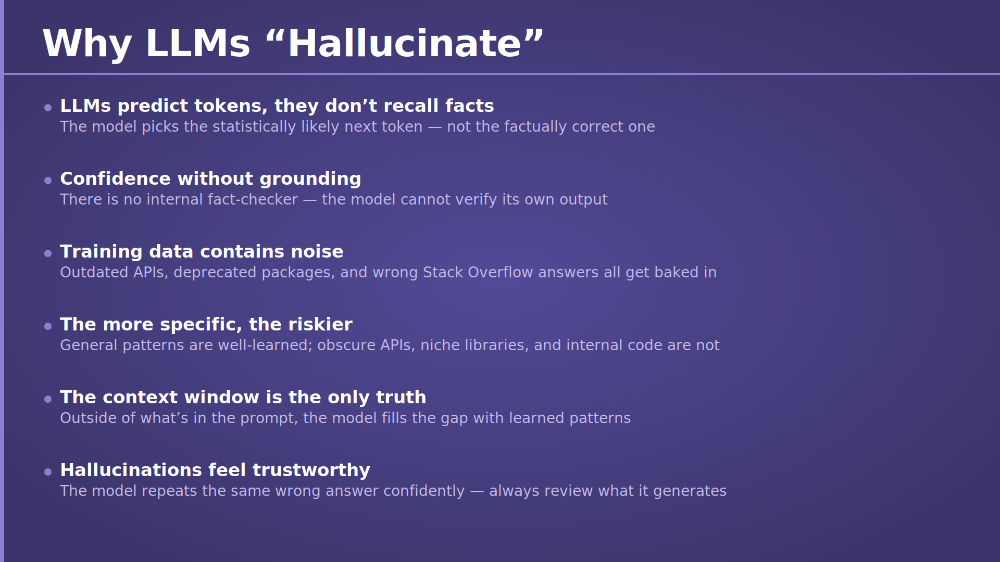

Hallucination is not a bug that will be patched away — it is a structural consequence of how LLMs work. The model is a next-token predictor trained to produce fluent, coherent text; it generates plausible-sounding continuations even when it lacks factual grounding. It cannot distinguish "I know this" from "this is the statistically likely continuation."

The practical response: ground outputs with retrieval-augmented generation, validate critical results programmatically, and never rely on a raw LLM response for high-stakes decisions without a verification step.

---

## Slide 12 — Demo 01 — Token Visualizer

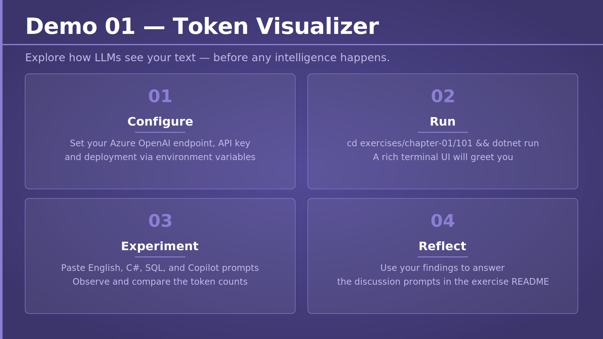

The Token Visualizer connects to Azure OpenAI and uses the local `TiktokenTokenizer` — the same tokenizer GPT-4o uses — to colour-code every token in your input and the model's reply. After each exchange it prints a comparison table showing the locally calculated token count against the actual usage figures reported by the API.

This reveals the three-token-per-message overhead, the reply-primer tokens, and how context accumulates across turns — foundational knowledge for managing cost and staying within context window limits.

---

## Slide 13 — The General Chatbot Pattern

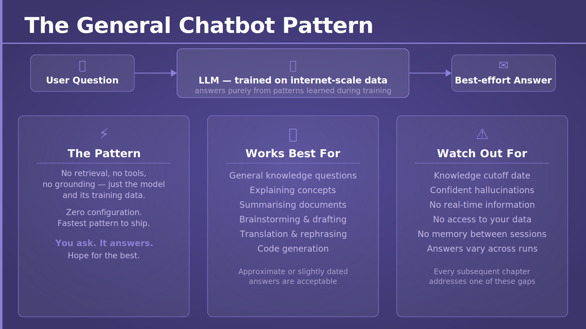

A general chatbot forwards your question directly to the LLM and returns whatever the model generates from its training data. No retrieval, no tools, no grounding — just the model and the patterns it internalized during training. This is the fastest pattern to ship and works surprisingly well for broad, factual, or explanatory questions where approximate or slightly dated answers are acceptable.

The tradeoffs are equally clear: the model has a knowledge cutoff date, no awareness of your specific data or context, no memory between sessions, and it can confabulate confidently. Knowing when this pattern is sufficient — and when it isn't — is the first design decision in every AI project. Every subsequent chapter addresses one of these gaps.

---

## Slide 14 — Demo 02 — Simple Chat Agent

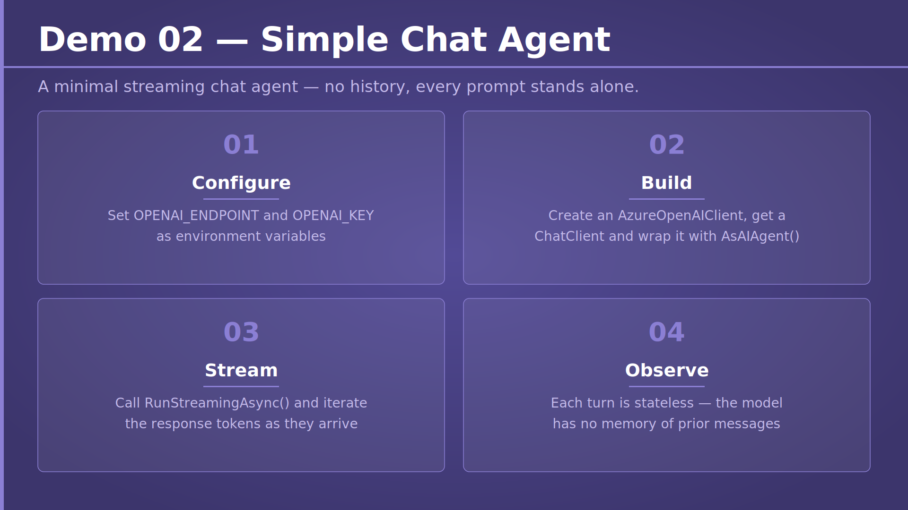

The simplest possible agent is a stateless chat loop. An `AzureOpenAIClient` creates a `ChatClient`, which is wrapped with `.AsAIAgent()` to produce an `IAIAgent`. Each call to `RunStreamingAsync(request)` sends only the current message — no session, no history, no carried context.

Ask "what did I just say?" and the model genuinely does not know. This stateless baseline is what every subsequent demo builds upon by adding sessions, history, persona, and tools.

---

## Slide 15 — The Training Pipeline

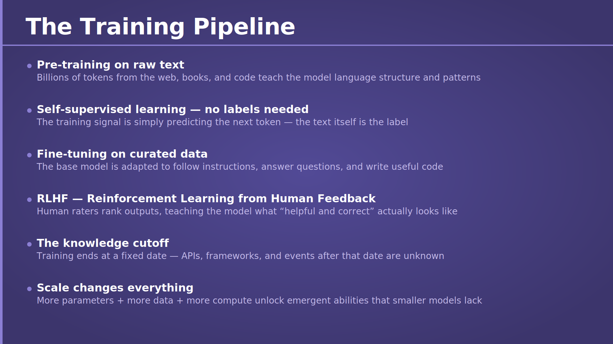

A production LLM is built in three stages. **Pre-training** ingests trillions of tokens and builds broad world knowledge through self-supervised next-token prediction. **Supervised fine-tuning** exposes the model to high-quality instruction–response pairs, teaching it to follow instructions and adopt a helpful tone. **RLHF alignment** uses human preference data to steer it away from harmful or unhelpful outputs.

This pipeline explains knowledge cut-offs (the model only knows what was in the pre-training corpus), why different model versions behave differently (different fine-tuning data), and why models can be both impressively knowledgeable and confidently wrong.

---

## Slide 16 — Context Windows

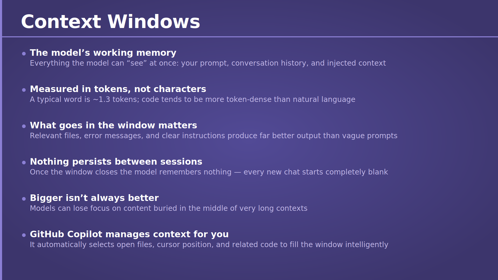

Every LLM processes a finite **context window** — the number of tokens visible in a single forward pass. Anything outside this window is completely invisible: the model cannot reason about it, summarise it, or acknowledge it exists. Current GPT-4o deployments support up to 128 000 tokens, but the entire context is sent and charged on every request.

The system prompt, full conversation history, retrieved documents, and the user message all compete for the same token budget. Long conversations eventually need summarisation or truncation, and large RAG payloads can easily crowd out conversation history.

---

## Slide 17 — The Chatbot with History Pattern

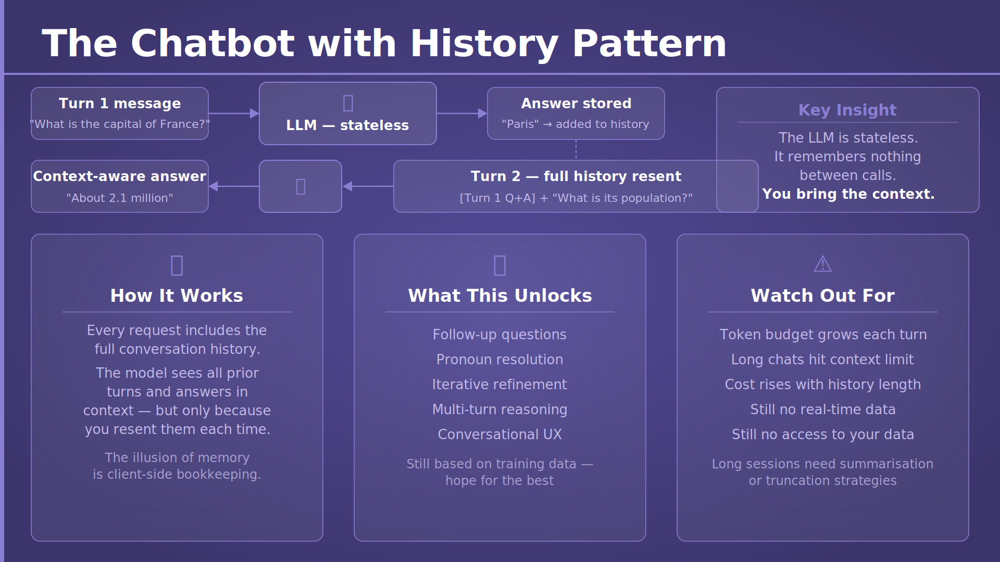

An LLM is completely stateless — it has no memory of previous calls and no awareness that a conversation is even happening. The "memory" in a multi-turn chatbot is an illusion maintained entirely by the client: every request includes the full history of prior messages, and the model answers as if it has been part of the conversation all along.

This makes follow-up questions, pronoun resolution, and iterative refinement possible. The cost is that the token budget grows with every turn, long conversations eventually hit the context window limit, and the answers are still based purely on training data. The practical implication: you own the history, you manage its size, and you decide when to summarise or truncate it.

---

## Slide 18 — Demo 03 — Chat with History

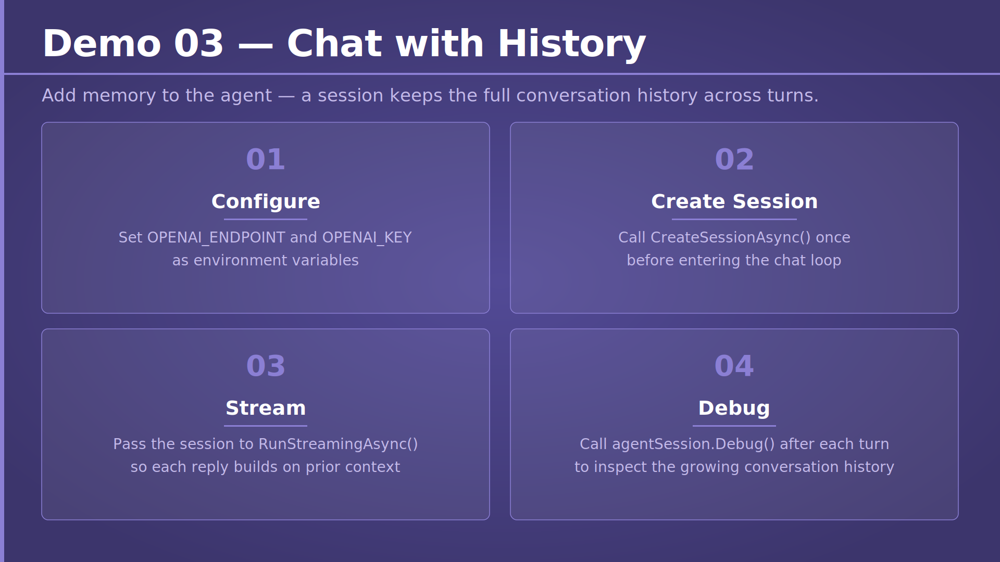

Adding `CreateSessionAsync()` before the loop creates a persistent session object. Every call to `RunStreamingAsync(request, agentSession)` now automatically includes the full message history, so the model can refer back to anything said earlier in the conversation.

After each assistant reply, `agentSession.Debug()` prints the current state of the history to the console, making message accumulation visible. Watch the context grow turn by turn and observe directly when it starts to approach its limit.

---

## Slide 19 — Shaping Behaviour with System Prompts

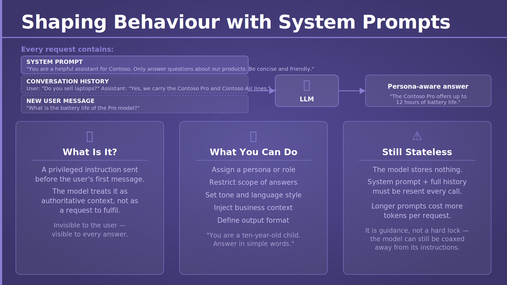

A system prompt is a privileged instruction placed before the user's first message. The model treats it as authoritative context — not a request to fulfil — and uses it to shape every answer it gives. You can use it to assign a persona, restrict the model to a specific topic, set tone and language style, inject business context, or define an output format.

The model is still stateless. There is no special "memory" for the system prompt: it must be included in every single request alongside the full conversation history. Longer system prompts consume more tokens on every call. And it is guidance, not a hard constraint — a determined user can sometimes coax the model away from its instructions.

---

## Slide 20 — Demo 04 — Chat with a Persona

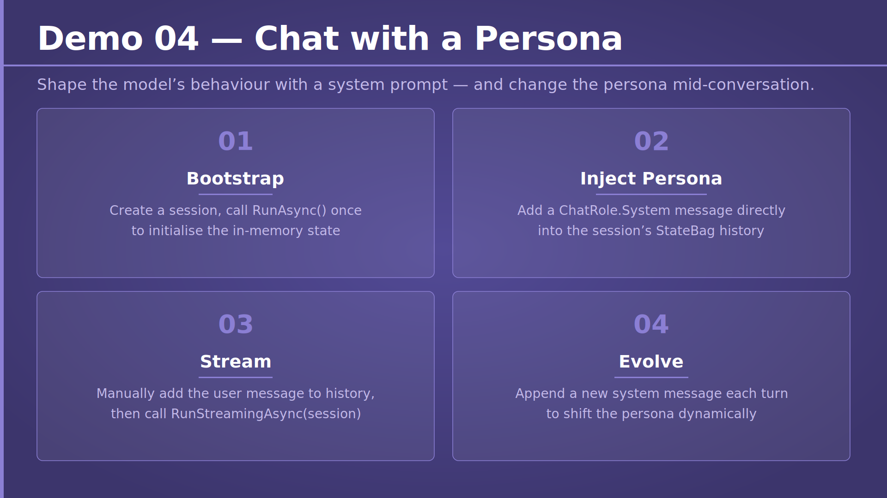

A `ChatRole.System` message is not limited to session startup — it can be written into the session's `StateBag` at any point. The demo bootstraps the session with `RunAsync()` to initialise in-memory state, then injects a system message instructing the model to respond as a ten-year-old child.

After every user turn, a new system message reduces the age by two years. The model's vocabulary, reasoning complexity, and sentence structure shift visibly across turns, demonstrating that persona is a live, mutable property of the conversation — not a one-time configuration.

---

## Slide 21 — Grounding with RAG and Tools

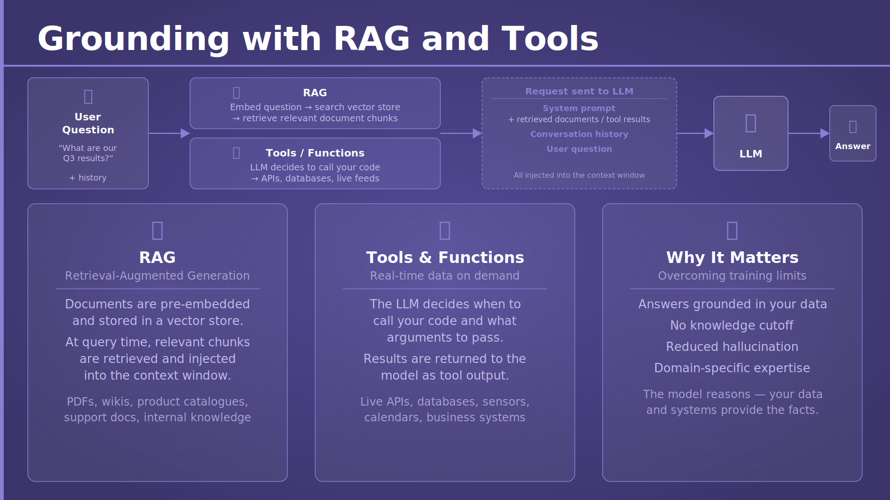

A general chatbot answers from training data alone — everything outside the model's training corpus is invisible to it. Two patterns break through that ceiling. **RAG (Retrieval-Augmented Generation)** pre-embeds your documents into a vector store; at query time the user's question is embedded too, the most relevant chunks are retrieved, and those chunks are injected into the context window alongside the question. **Tools and functions** take a different approach: the LLM itself decides when it needs external information, calls your code with the arguments it requires, and receives the result back before composing its answer.

Both patterns work by feeding real information into the context window — the model still reasons over text, but that text now comes from your data and your systems rather than training alone. This grounds answers in facts, removes the knowledge cutoff, and makes the difference between a general chatbot and a domain expert.

---

## Slide 22 — Demo 05 — Plugins and Functions

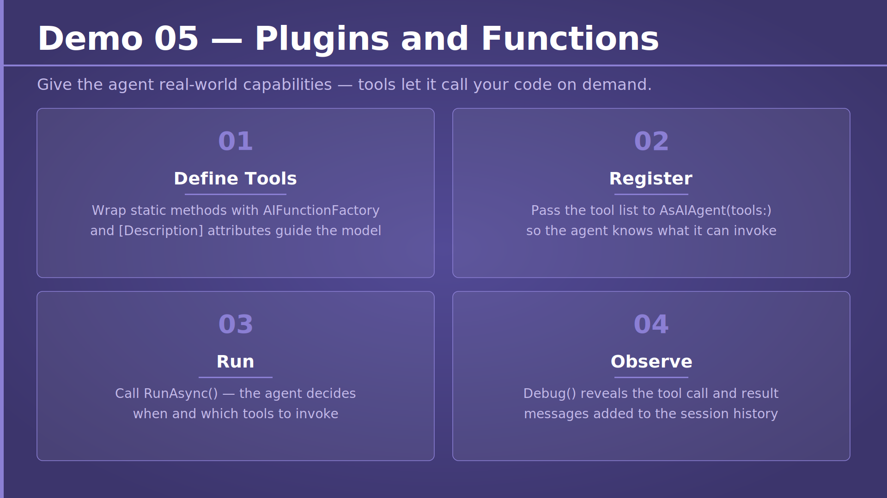

**Tool use** lets an agent call your code during a conversation. Static C# methods decorated with `[Description]` attributes are converted into `AITool` instances by `AIFunctionFactory.Create()`, then passed to `AsAIAgent(tools:)`. The agent receives tool definitions alongside the user's message and autonomously decides whether and when to invoke them.

Ask "what time is it?" and the agent calls `GetTime()`. Ask "what is the date?" and it calls `GetDate()`. Ask a general question and it answers directly without any tool call. `chatSession.Debug()` after each turn reveals the tool-call and tool-result messages the framework adds to the session history automatically.

---

## Slide 23 — Demo 06 — Structured Output

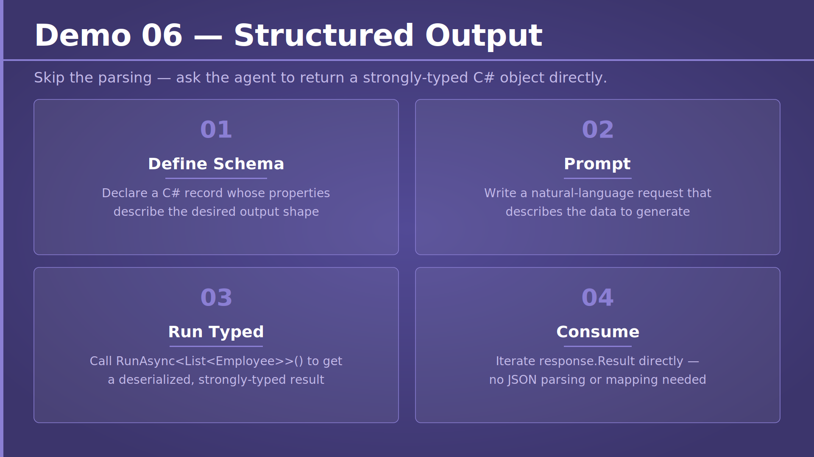

The generic `RunAsync<T>()` overload returns a response that deserialises directly into a C# type. `RunAsync<List<Employee>>()` returns a `List<Employee>` — no JSON parsing, no `JsonSerializer.Deserialize`, no error handling for malformed output. The framework handles schema generation, response forcing, and deserialisation internally.

This pattern is ideal whenever the agent's output feeds into downstream code: batch data generation, information extraction from unstructured text, classification, and typed API integration. The C# record declaration doubles as both the output schema and the data contract.

---

## Slide 24 — Demo 07 — Azure OpenAI Agent

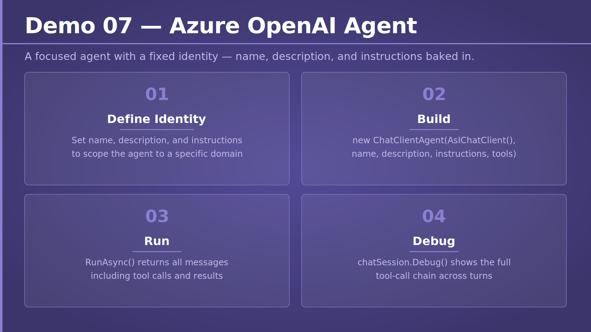

`ChatClientAgent` is the constructor-based agent type. Unlike `AsAIAgent()`, which wraps any existing client with minimal configuration, `ChatClientAgent` accepts a **name**, **description**, and **instructions** at construction time. These three fields lock the agent into a specific role: the TimeAgent refuses to answer anything unrelated to the current date and time.

The `GetChatClient("gpt-5-chat").AsIChatClient()` call bridges the Azure OpenAI SDK to the abstract `IChatClient` interface — the abstraction that makes swapping model providers in the next demo a single constructor argument.

---

## Slide 25 — Running Local LLMs with Ollama

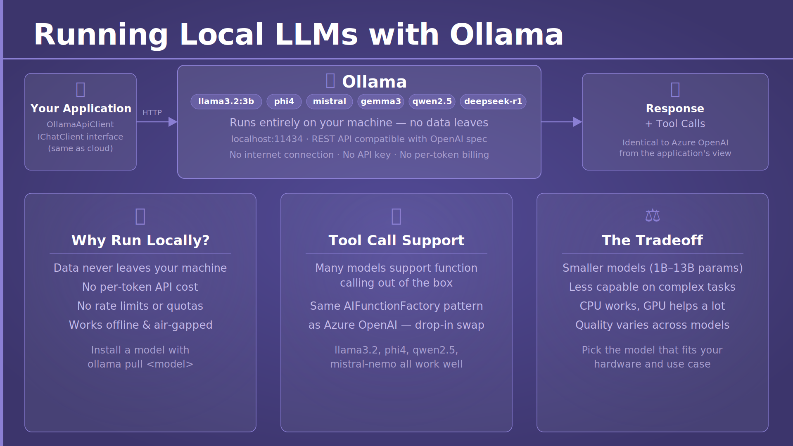

Ollama is an open-source tool that lets you download and run large language models entirely on your own hardware. Your application talks to it through a simple REST API on `localhost:11434` — no Azure subscription, no API key, and no data ever leaves the machine. Dozens of models are available: Llama 3.2, Phi 4, Mistral, Gemma 3, Qwen 2.5, DeepSeek R1, and many more, each installable with a single `ollama pull <model>` command.

A growing number of these models support **function and tool calling** using the same request/response structure as cloud-hosted models. That means the `AIFunctionFactory` pattern works without modification — the model decides when to call your tools and Ollama returns the tool-call payloads just as Azure OpenAI would. The practical tradeoffs are model size (typically 1B–13B parameters rather than the hundreds of billions in GPT-4o) and hardware dependency: a CPU works, but a GPU reduces latency significantly.

---

## Slide 26 — Demo 08 — Local Agent with Ollama

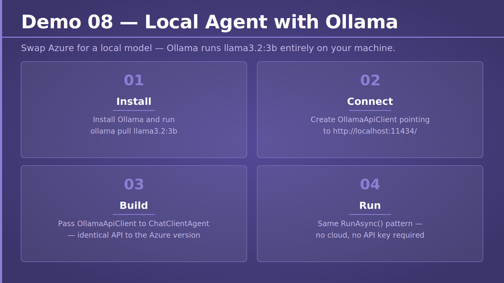

The only change from Demo 07 is replacing `AzureOpenAIClient` with `OllamaApiClient` pointing to `http://localhost:11434/`. Because both implement `IChatClient`, `ChatClientAgent` does not need to change at all.

Ollama runs `llama3.2:3b` entirely on the local machine: no Azure subscription, no API key, no data leaving the laptop. This makes it the go-to choice for offline development, privacy-sensitive workloads, and environments without internet access. The tradeoff is model capability — a 3-billion-parameter local model is noticeably less capable than GPT-4o.

---

## Slide 27 — Microsoft AI Foundry Agents

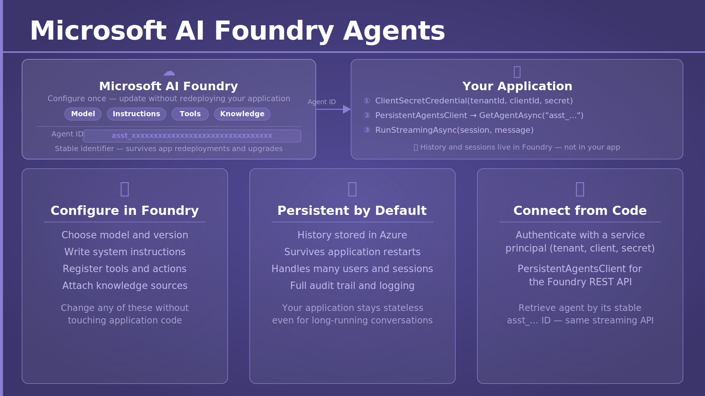

Microsoft AI Foundry is a cloud platform where you define agents once and run them from any application. An agent's model, system instructions, registered tools, and knowledge sources are all configured in Foundry — either through the portal or via the SDK — and each agent receives a stable `asst_...` identifier. Change the instructions or swap the model without touching application code; the ID stays the same.

The key architectural difference from all previous patterns is that **conversation history and sessions are stored in Azure, not in your application**. Your code authenticates with a service principal (`ClientSecretCredential`), creates a `PersistentAgentsClient`, retrieves the agent by its ID, and calls the familiar `RunStreamingAsync()` API. This makes long-running, multi-user conversations straightforward: the application stays stateless while Foundry manages every session.

---

## Slide 28 — Demo 09 — Agent with Microsoft Foundry

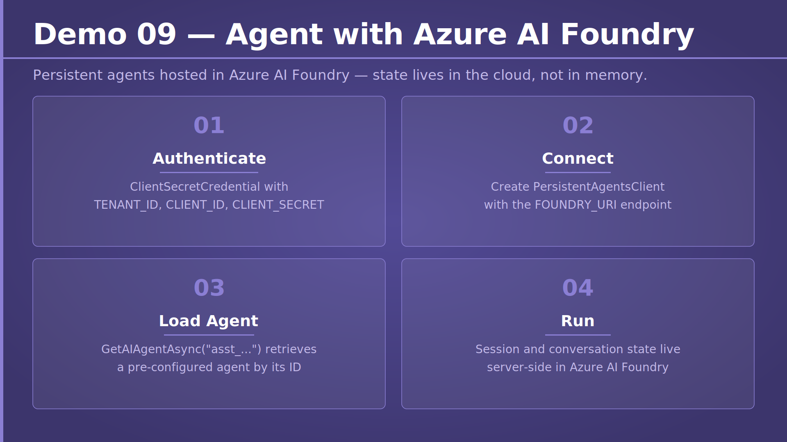

Microsoft AI Foundry hosts **server-side persistent agents**. Authentication uses `ClientSecretCredential` with a service principal (TENANT_ID, CLIENT_ID, CLIENT_SECRET), and `PersistentAgentsClient` connects to the Foundry endpoint. The agent is retrieved by its pre-assigned ID (`asst_...`) rather than constructed in code.

The critical difference from earlier demos: **the session and all conversation history live in Microsoft Foundry**, not in the application's memory. This enables multi-user scenarios, long-running conversations that survive application restarts, and agent definitions managed in the Foundry portal without code deployments.

---

## Slide 29 — Multi-Modal LLMs

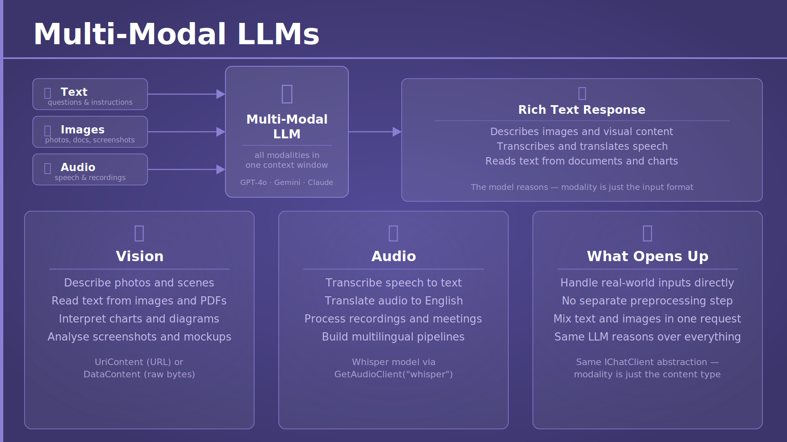

A **multi-modal LLM** accepts more than text — it processes images, audio, and other data types alongside text prompts, all within the same context window. GPT-4o, for example, can describe a photograph, read handwriting from a scan, interpret a bar chart, transcribe speech, or translate audio from one language to another, treating each modality as just another kind of input to reason over.

From a developer perspective, the Agent Framework exposes dedicated client types per modality: `IChatClient` with `DataContent` (raw bytes) or `UriContent` (remote URL) payloads for vision tasks, and `IAudioClient` via `GetAudioClient("whisper")` for speech transcription and translation. The model handles the reasoning; you include the right content type in the message and receive a unified text response.

---

## Slide 30 — Demo 10 — Audio and Image Understanding

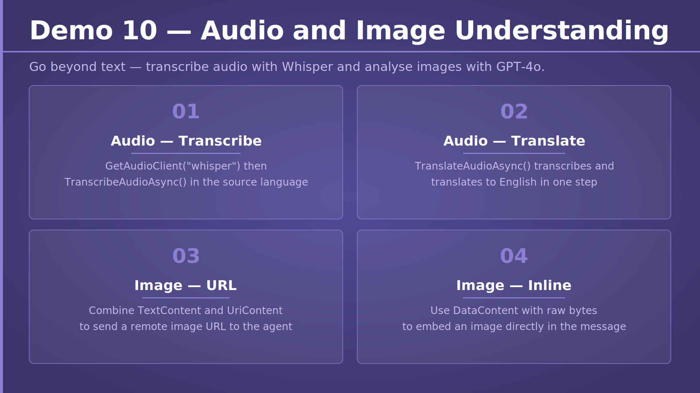

Two companion projects cover two modalities. The **audio** project uses the Whisper model via `GetAudioClient("whisper")`: `TranscribeAudioAsync()` returns speech in its original language, while `TranslateAudioAsync()` both transcribes and translates to English in a single API call — useful for multilingual content pipelines.

The **image** project constructs multimodal `ChatMessage` objects by combining a `TextContent` instruction with a `UriContent` (remote URL) or a `DataContent` (raw bytes read from disk). GPT-4o processes both together, enabling tasks like translating text visible inside an image, describing visual content, or extracting data from charts and screenshots.

---

## Slide 31 — The Model Context Protocol (MCP)

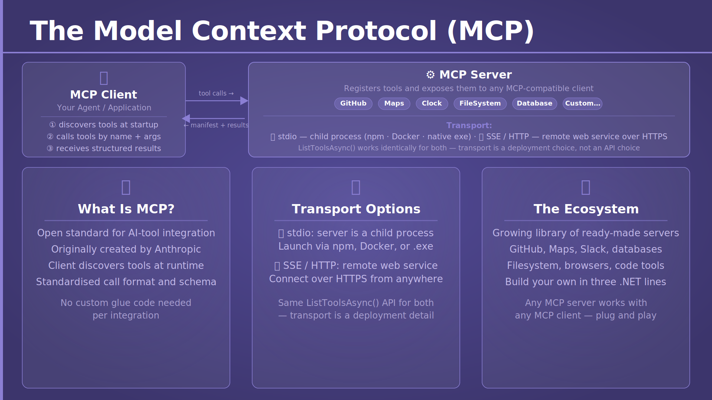

The Model Context Protocol is an open standard — originally created by Anthropic — that defines how AI agents discover and invoke external tools at runtime. An **MCP server** registers a collection of tools with descriptions and input schemas; an **MCP client** (your agent or application) connects to that server and calls `ListToolsAsync()` to receive the full tool manifest. From that point on the agent can invoke any discovered tool by name with structured arguments, exactly as if it were a locally defined `AIFunctionFactory` function.

The protocol supports two transport mechanisms: **stdio** (the server runs as a child process — an npm package, a Docker container, or a native executable) and **SSE/HTTP** (the server runs as a remote web service reachable over HTTPS). The same client-side API works with both. This means a single MCP server implementation can be connected to any MCP-compatible host without modification: Claude Desktop, Visual Studio Code Copilot, your custom agent, or anything else that speaks the protocol.

---

## Slide 32 — Demo 11 — MCP Clients

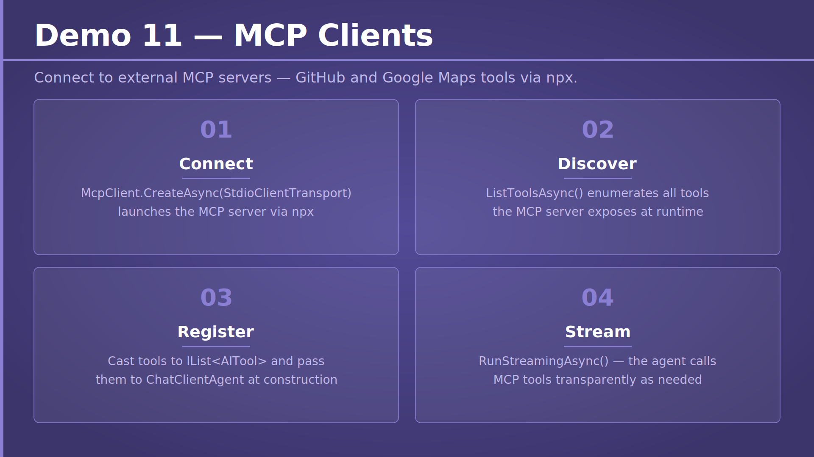

MCP clients connect to external tool servers without writing any server code. `McpClient.CreateAsync(new StdioClientTransport(...))` launches an npm MCP server as a child process — `@modelcontextprotocol/server-github` for repository data or `@modelcontextprotocol/server-google-maps` for travel directions.

`ListToolsAsync()` queries the server for its full tool manifest at runtime, so the agent always works with the current available tools regardless of server version. Cast to `IList<AITool>` and hand to `ChatClientAgent` — the agent then calls GitHub or Maps tools exactly as it would call any local `AIFunctionFactory` tool.

---

## Slide 33 — Demo 12 — MCP Server and Client

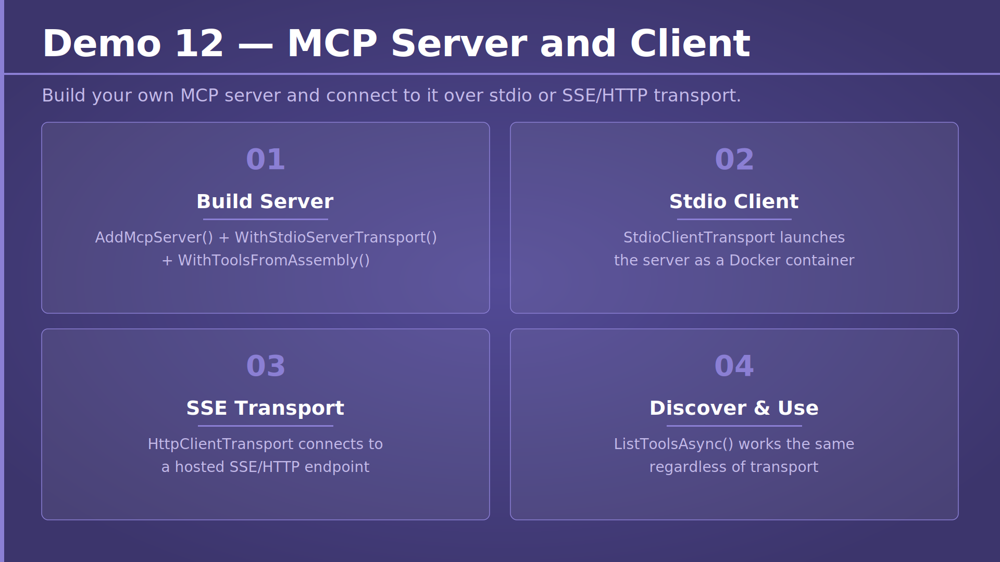

Building an MCP **server** takes three lines: `AddMcpServer()`, `.WithStdioServerTransport()`, and `.WithToolsFromAssembly()` — the framework discovers all `[McpServerTool]`-annotated methods automatically. The server can also be configured for SSE/HTTP transport to run as a hosted web service.

On the **client** side, `StdioClientTransport` launches the server as a Docker container (`docker run -i --rm djohnnie/clockmcp`), while `HttpClientTransport` connects to a running SSE endpoint over HTTPS. `ListToolsAsync()` works identically in both cases — transport is a deployment detail, not an API decision.

---

## Slide 34 — Embeddings and Vector Search

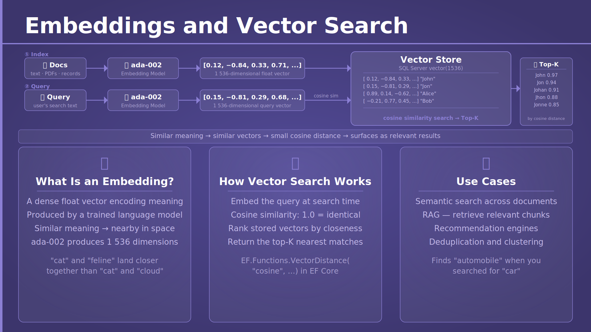

An **embedding** is a dense float vector that encodes the meaning of a piece of text rather than its exact characters. Two pieces of text with similar meaning produce vectors that are geometrically close, while unrelated texts produce vectors that are far apart. The `text-embedding-ada-002` model converts any text into a 1 536-dimensional vector; those vectors are stored in a database column declared as `vector(1536)`.

At query time the user's input is embedded using the same model, producing a query vector. **Cosine similarity** measures the angle between the query vector and every stored vector: 1.0 means identical direction, 0.0 means unrelated. Ranking by cosine distance and returning the top-K closest entries gives semantic search — finding "Jon" and "Johan" when you search for "John", even though the strings differ.

---

## Slide 35 — Vectors — A 2D Illustration

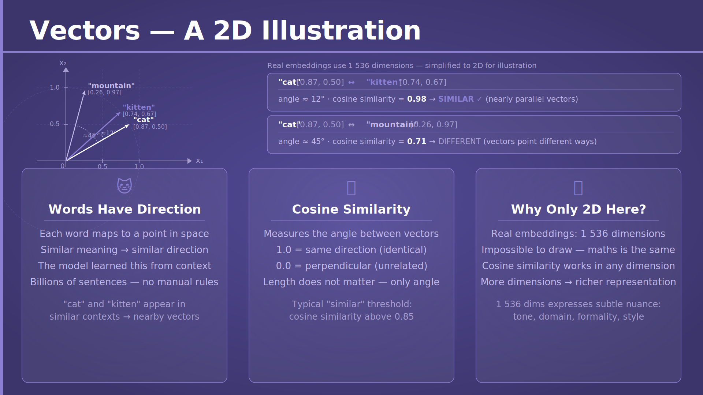

Real embedding models produce vectors with thousands of dimensions, but the core idea is visible in two. Here "cat" sits at [0.87, 0.50] and "kitten" at [0.74, 0.67]: their vectors point in nearly the same direction, giving a cosine similarity of 0.98. "Mountain" at [0.26, 0.97] points a different way entirely — cosine similarity 0.71 — because it appears in very different contexts in the training data.

The length of a vector is irrelevant; only its direction matters. Cosine similarity is the cosine of the angle between two vectors: 1.0 means identical direction, 0.0 means perpendicular (unrelated). In 1 536 dimensions the geometry is the same — just impossible to draw.

---

## Slide 36 — Demo 13 — Embeddings and Vector Search

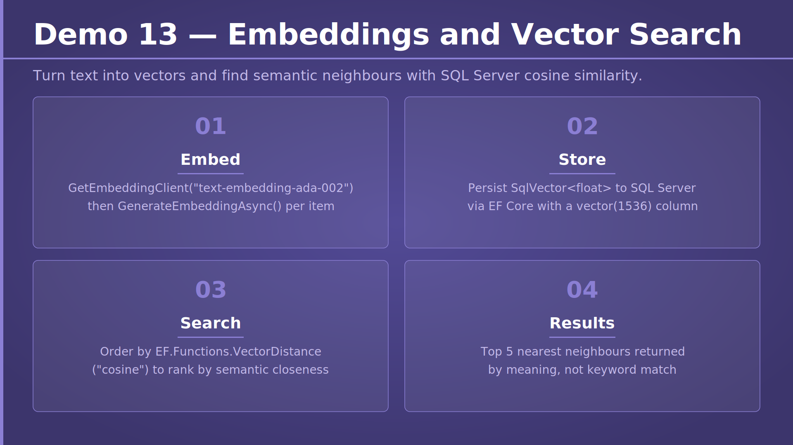

**Semantic search** finds items by meaning rather than by keyword. `GetEmbeddingClient("text-embedding-ada-002")` generates 1 536-dimensional float vectors for a dataset of first names. Each vector is stored in SQL Server using a `vector(1536)` column via EF Core.

At query time the user's input is also embedded, and `EF.Functions.VectorDistance("cosine", ...)` ranks stored names by cosine similarity. The result is the five most semantically related names — "Jon" appears near "John", phonetically similar names cluster together, and names sharing cultural or linguistic roots end up closer in vector space than pure string matching could ever achieve.

---

## Slide 37 — Chatbot vs. Agent — Key Differences

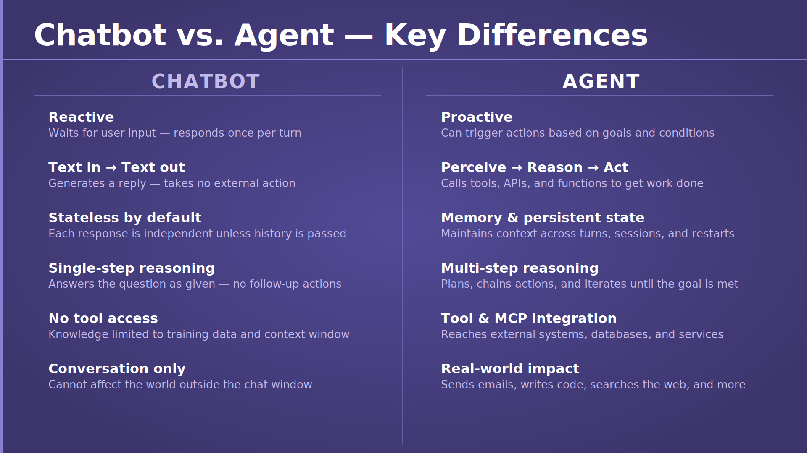

A chatbot is reactive and text-only: it waits for input, generates a reply from its training data, and has no way to affect the world outside the chat window. An agent adds a **perceive → reason → act** loop: it can call tools, access external systems, maintain persistent state, and chain multiple steps to complete a goal without further user prompting.

The demos in this chapter trace that journey — each one adds a capability that moves a plain chatbot one step closer to a fully autonomous agent.

---

## Slide 38 — Beyond Chatbots — What Makes an AI Agent?

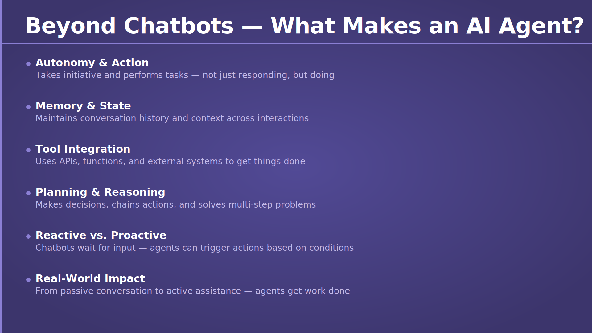

A chatbot produces text in response to text. An agent **perceives** its environment (user messages, tool results, memory), **reasons** about what to do next, **acts** (calls tools, delegates to sub-agents, retrieves data), and **observes** the outcomes before deciding its next move. This perception–reasoning–action loop can repeat multiple times within a single user turn.

Each capability added across the demos — sessions, personas, tools, MCP, workflows — is an expansion of what the agent can perceive or act upon, not just cosmetic variation.

---

## Slide 39 — Agent Orchestration — Coordinating Intelligence

Several patterns exist for composing multiple agents. A **router** classifies the user's intent and delegates to the most suitable specialist. A **pipeline** passes each agent's output as the next agent's input, enabling multi-stage processing. A **handoff** transfers full conversational context from one agent to another mid-conversation, so the receiving agent can continue seamlessly.

Orchestration is what turns a collection of single-purpose agents into a system capable of handling complex, multi-step tasks — from simple routing in MijnCopilot to fully declarative handoff graphs in the Workflows demo.

---

## Slide 40 — Demo 14 — Multi-Agent Copilot

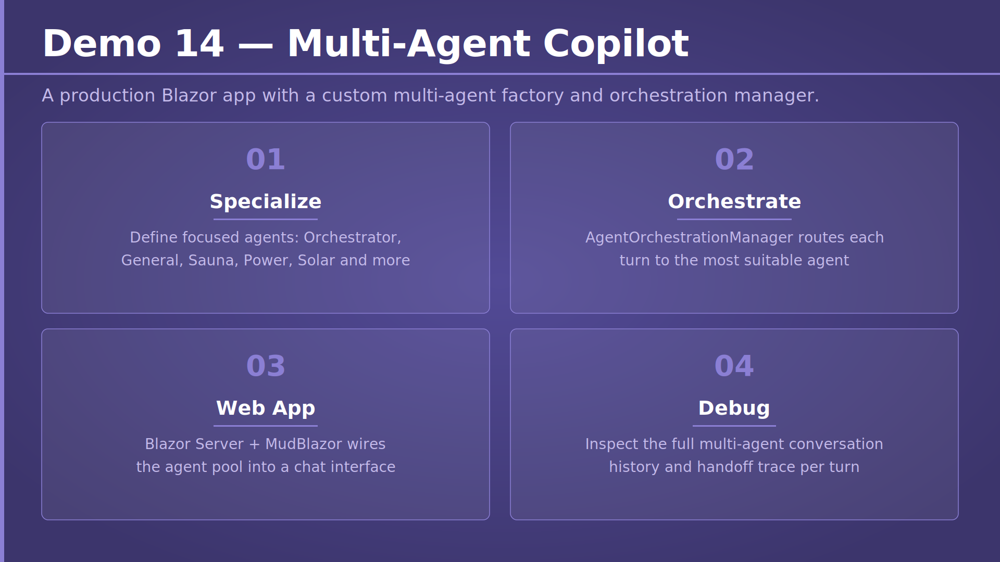

MijnCopilot is a Blazor Server application with a MudBlazor chat UI that orchestrates a fleet of specialised agents through a custom `AgentOrchestrationManager`. Available agents cover general questions, time queries, smart home data (sauna temperature, solar yield, power consumption, car status, heating), and a photo carousel — each with its own instructions, tools, and MCP connections.

When a user sends a message, the orchestrator routes it to the most suitable specialist, which answers and returns control. The orchestrator composes the final reply, and the full multi-agent conversation history — including which agent handled which turn — is maintained in the session.

---

## Slide 41 — Demo 15 — Distributed Agents with Orleans

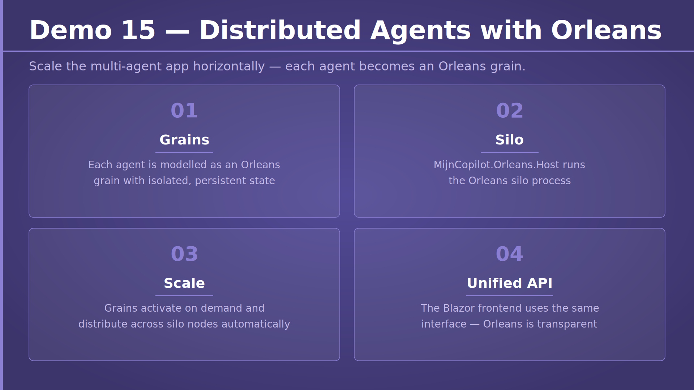

Microsoft Orleans makes MijnCopilot horizontally scalable. Each agent is reimplemented as an **Orleans grain** — a lightweight virtual actor with isolated, persistent state and a stable identity. Grains activate on demand and distribute across any number of silo nodes without application-level placement logic.

`MijnCopilot.Orleans.Host` runs the Orleans silo; the Blazor frontend calls the same interfaces as before — the Orleans layer is completely transparent to presentation code. Scaling out means adding more silo nodes: no code changes, no data migration, no downtime.

---

## Slide 42 — Demo 16 — Agent Workflows

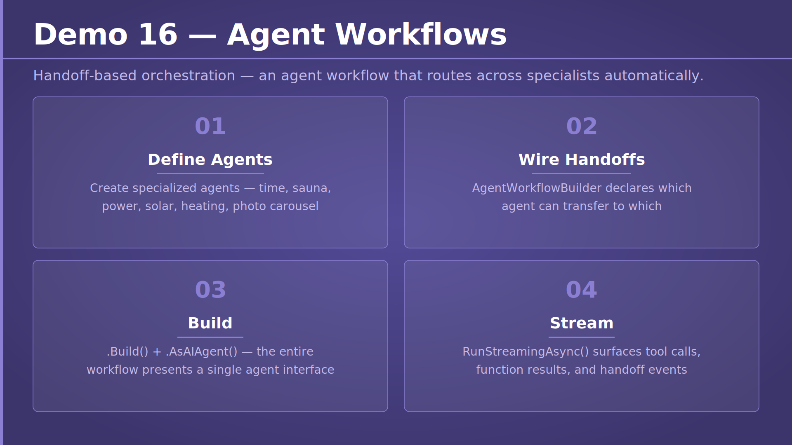

`AgentWorkflowBuilder` enables declarative handoff-based orchestration. The workflow is defined by specifying which agent can transfer control to which others: the Orchestrator can hand off to any of nine specialists (General, Time, Sauna, Car, Power, Solar, Heating, PhotoCarousel, and a persistent Foundry agent), and each specialist hands back to the Orchestrator when done.

`.Build().AsAIAgent()` compiles the handoff graph into a single `IAIAgent`. Callers use the familiar `RunStreamingAsync()` API — routing, handoffs, MCP tool calls, and function result exchanges are handled internally. Streaming output surfaces each step in real time: which agent is active, which tool was called, and what the result was.

---

## Slide 43 — Demo 17 — Document Intelligence

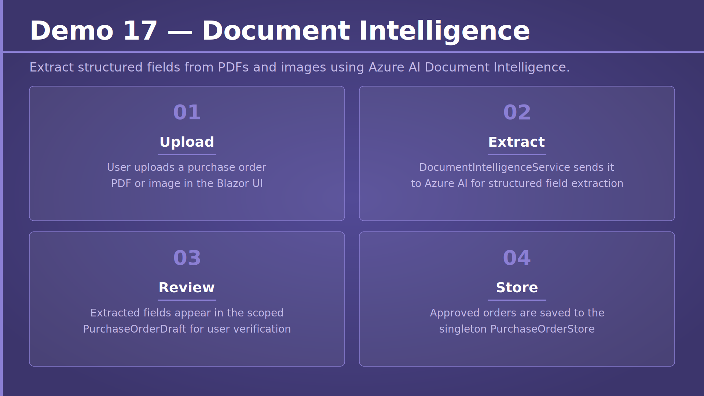

**Azure AI Document Intelligence** extracts structured fields from uploaded PDFs and images. The `DocumentIntelligenceService` singleton sends each uploaded file to the Azure AI API, which returns a structured result containing recognised fields — supplier name, line items, quantities, unit prices, totals, and more.

Extracted data populates a scoped `PurchaseOrderDraft` (one instance per browser tab), where the user reviews and corrects the values before committing. Once approved, the draft is written to the singleton `PurchaseOrderStore`, which aggregates all processed orders in memory and displays them in the application's order list.

---

## Slide 44 — Demo 18 — Content Understanding

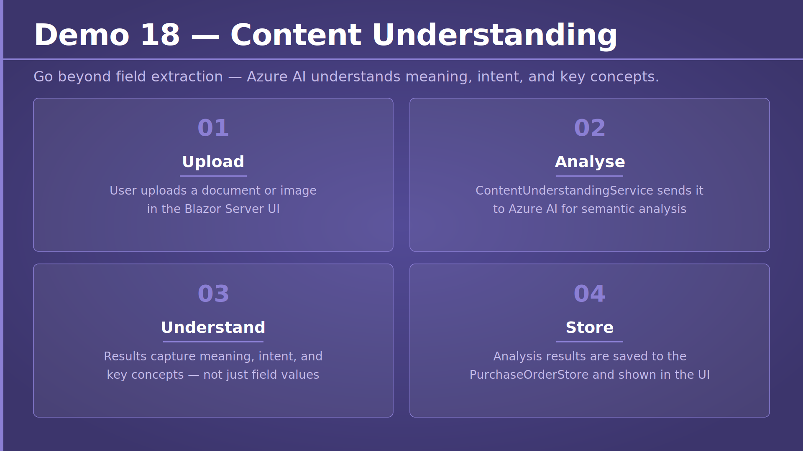

**Azure AI Content Understanding** analyses documents and images at a semantic level rather than extracting predefined field values. Where Document Intelligence answers "what is the value in the Total field?", Content Understanding answers "what is this document about, what does it request, and what are the key obligations it implies?"

The application structure mirrors Demo 17 — Blazor Server, MudBlazor, `PurchaseOrderStore`, `PurchaseOrderDraft` — with the difference entirely in the service layer: `ContentUnderstandingService` returns meaning, intent, and relationships rather than field-level extractions. Together, Demos 17 and 18 show the spectrum from structured extraction to open-ended semantic comprehension.
